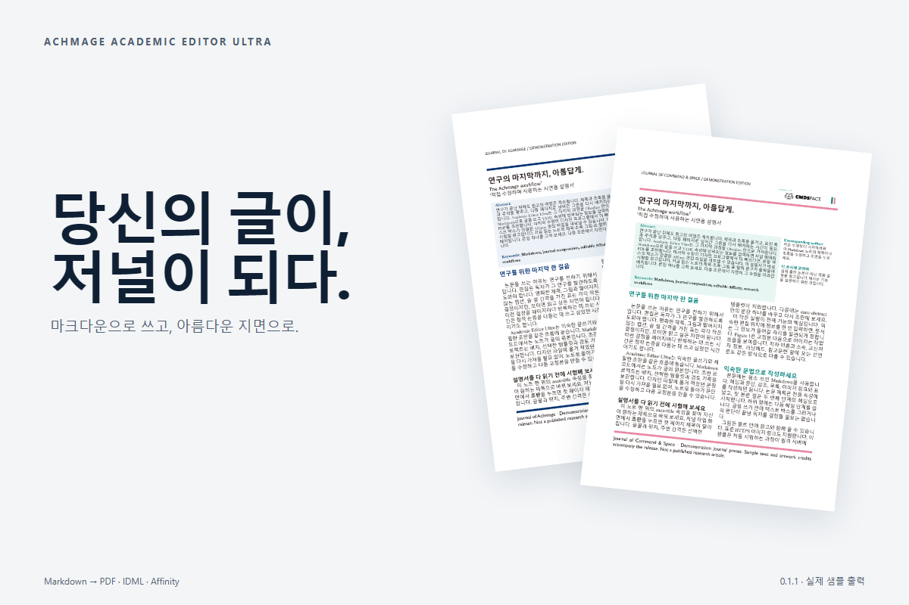
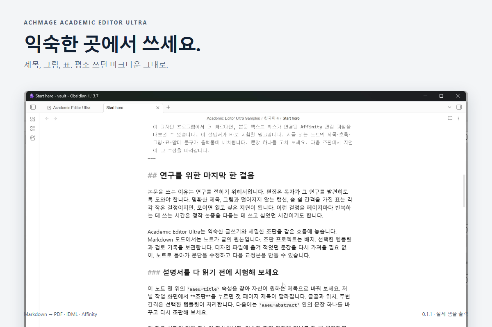
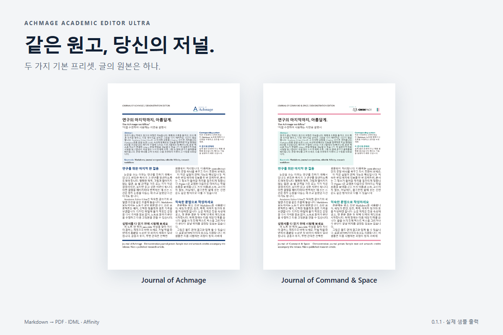
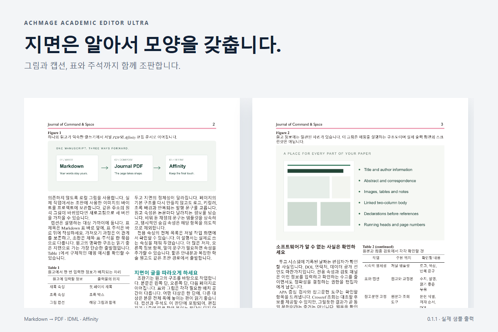
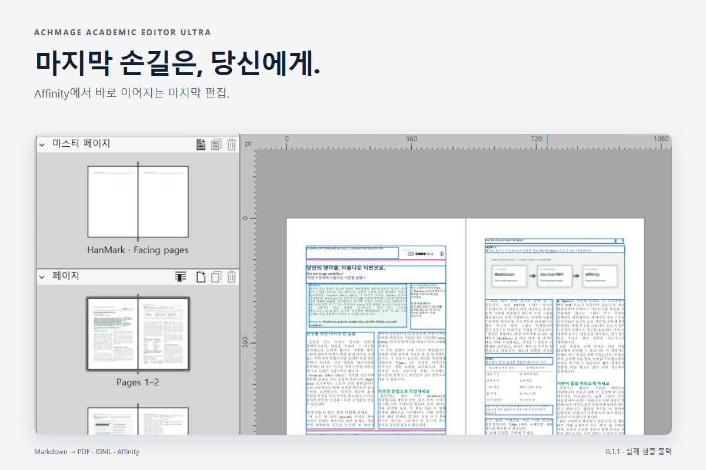

# Achmage Academic Editor Ultra

### 당신의 글이, 저널이 되다.

마크다운으로 쓰고, 아름다운 지면으로. 마지막 편집은 당신의 손으로.



[English](README.md) · [0.1.1 다운로드](https://github.com/laguna821/achmage-academic-editor-ultra/releases/tag/0.1.1) · [시연 영상](docs/launch/videos.md) · [전체 샘플](https://github.com/laguna821/achmage-academic-editor-ultra/releases/download/0.1.1/aaeu-working-samples-0.1.1.zip)

Obsidian에서 Markdown 또는 저자의 Word 원고를 저널 형태로 조판하는 독립 플러그인입니다. HanMark의 조판 코드를 기반으로 분리한 **0.1.1 미리보기 버전**입니다. HanMark를 설치하지 않아도 동작하며, 두 플러그인을 함께 사용할 수 있습니다.

## 설명서 자체로 시험해 보세요

**설명서 원고로 시작**을 누르면 초록·교신저자·그림·표·주석·말미 선언문이 포함된 영문 또는 국문 원고가 열립니다. 마크다운에서 제목을 고치고 **조판**을 누르세요. 기존 샘플은 수정 내용을 유지하며, **새 사본 만들기**로 다시 시작할 수 있습니다.



**Journal of Achmage**의 딥네이비, **Journal of Command & Space**의 틸·핑크 프리셋이 기본으로 들어 있습니다. 로고는 벡터 PDF로 보존합니다. 템플릿 위자드에서 프리셋을 바꾸고 미리보기 후 적용하면 원고 내용은 그대로 유지됩니다.



이름과 색상은 시연용 저널의 정체성입니다. 실제 학술지 발행이나 대학의 공식 보증을 의미하지 않습니다. [로고 출처](assets/brands/README.md).





커뮤니티 디렉터리에 아직 등록되지 않았습니다. 릴리스 ZIP의 `main.js`, `manifest.json`, `styles.css`를 볼트의 `.obsidian/plugins/achmage-academic-editor-ultra/`에 넣고 Obsidian을 다시 연 뒤 플러그인을 켜세요.

## 시작

1. 리본의 **Academic Editor Ultra** 또는 명령 팔레트의 **저널 편집 열기**를 실행합니다.
2. **새 Markdown 원고**에서 저널 템플릿을 선택합니다. 전체 `aaeu-*` YAML 속성과 본문 골격이 생성됩니다.
3. Markdown에서 속성과 본문을 작성하고 **조판**을 누릅니다. PDF 미리보기, 검사 결과, PDF·IDML·AF 내보내기가 같은 프로젝트에 있습니다.

기존 노트는 **현재 Markdown 원문으로 저널 시작**으로 연결합니다. 원래 YAML과 본문을 자동 수정하지 않습니다. 속성 안내에서 필요한 항목을 복사할 수 있습니다. 기존 `title`, `abstract`, `keywords`, `runningTitle` 등의 입력도 지원합니다.

## 두 가지 입력 경로

- **Markdown 원문 모드:** 내용은 Markdown에만 작성합니다. 저널 화면은 원문 위치 이동, 검사, 템플릿·배치 조정과 출력에 사용합니다. 원문 수정·이름 변경·로컬 이미지 변경을 추적하며 출력 전에 다시 확인합니다.
- **Word 편집본:** 저자가 보낸 DOCX를 가져와 기존 본문 편집기에서 정리·검토합니다. 기존 저널 편집 기능을 유지합니다.

프로젝트는 `Academic Editor Ultra/`에 저장합니다. **HanMark 프로젝트 복사**는 `HanMark Journals/`의 원고와 사용자 템플릿을 복사하며 원본을 변경하지 않습니다. 같은 원본을 반복 복사하면 기존 복사본을 엽니다. 이전 Markdown 편집본은 수동 변경을 보존하기 위해 기존 편집 방식을 유지합니다. **기존 편집본을 원문 모드로 복사**에서 차이를 확인한 후 별도 원문 프로젝트를 만들 수 있습니다.

## Markdown 규칙

제목은 `aaeu-title`, 본문 절은 `##`, 하위 절은 `###`–`######`를 사용합니다. 기존 `# 제목`도 지원합니다. 표준 표·목록·인용·강조·링크 및 로컬 이미지, Obsidian 이미지 임베드, HTTPS 이미지 URL을 읽습니다. CMDS Eagle의 R2 이미지 링크도 표준 Markdown 이미지로 처리합니다.

그림과 표의 명시적 인접 캡션을 우선 사용하며, 그림의 alt는 대체 캡션입니다. 캡션을 새로 만들어 내지 않습니다. 이미지 안 글자·불명확한 연결은 기존 검토 기능으로 확인합니다.

- [사용 순서와 예시](docs/quick-start.ko.md)
- [전체 속성 매핑](docs/markdown-properties.md)
- [전체 원고 템플릿](templates/journal-manuscript.md)
- [개발 및 검증 기록](docs/research/R-041-independent-markdown-editor.md)

빈 문구는 템플릿을 상속합니다. `*-hide: true`는 의도적으로 숨깁니다. 필수 말미 항목을 숨길 때는 `*-omission-reason`을 입력합니다. YAML과 본문에 같은 초록·선언문이 있으면 한 번만 출력하고, 내용이 다르면 오류로 알립니다. 접수일·DOI·선언문·확인 기록은 자동으로 만들어 넣지 않습니다.

## 이미지와 출력

원격 이미지의 실제 바이트와 해시를 프로젝트에 보관합니다. 이후 출력은 저장된 사본을 사용합니다. **원격 이미지 새로고침**은 동일 URL을 다시 조회합니다. 업로드 중 표시자·만료 URL·오류 페이지·누락 파일은 검사 결과에 나타납니다. 캐시가 최신 원격 이미지라는 보장은 하지 않습니다.

설치 글꼴을 Windows/macOS/Linux에서 검색하고 필요한 글꼴만 프로젝트에 보관합니다. 없는 서체는 명시적으로 대체합니다. 글꼴 라이선스는 사용자가 확보해야 하며 저장소에 상용 글꼴을 포함하지 않습니다.

PDF는 조판 결과입니다. IDML/AF는 디자인 도구에서 마지막 편집을 이어가기 위한 출력입니다. AF는 연결 본문 프레임, 벡터 PDF 그림, 마주 보는 페이지와 마스터, 동적 페이지 번호를 지원합니다. 현재 AF 사전 검사는 지원되지 않는 인라인 이미지나 확인된 크롭 등을 명시적으로 거절합니다. AF에서 추가한 수정은 Markdown으로 역변환하지 않습니다.

## 개발

```sh
npm ci --ignore-scripts
npm run check
npm run docs:yaml
```

조판과 APA 검사는 로컬에서 실행합니다. Crossref 조회와 원격 이미지 다운로드만 인터넷을 사용하며 AI 서비스 또는 AI 토큰을 사용하지 않습니다. 개인 원고·폰트·시험 산출물은 Git에 포함하지 않습니다. macOS CI는 유지하며 macOS 실기 검증은 이번 배포의 필수 조건에서 제외합니다.

## License

MIT. HanMark에서 이어받은 코드와 제3자 라이브러리의 고지는 [LICENSE](LICENSE), [THIRD_PARTY_NOTICES.md](THIRD_PARTY_NOTICES.md)에 보존합니다.
