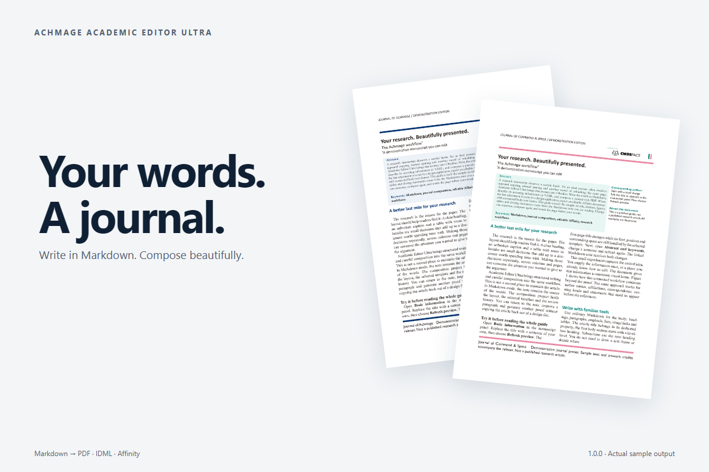
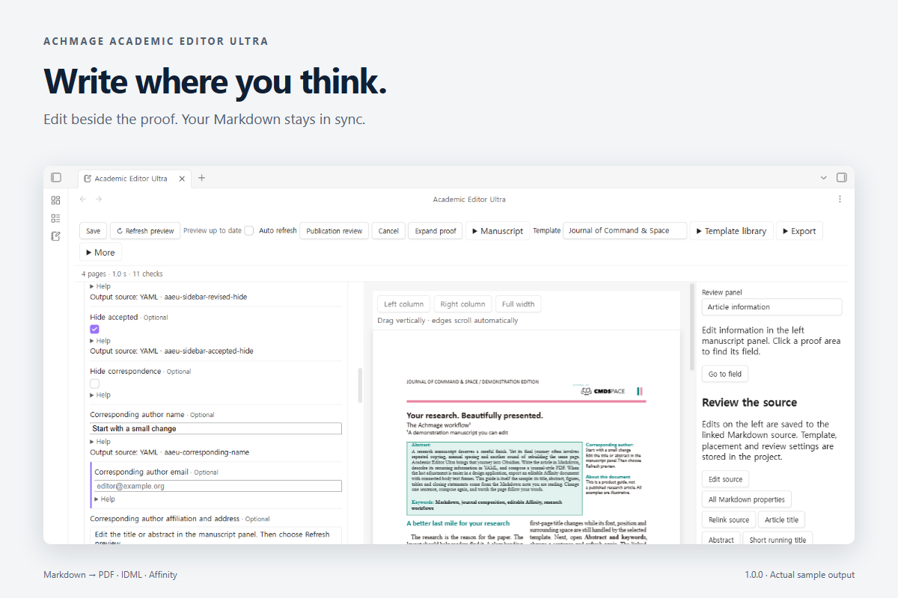
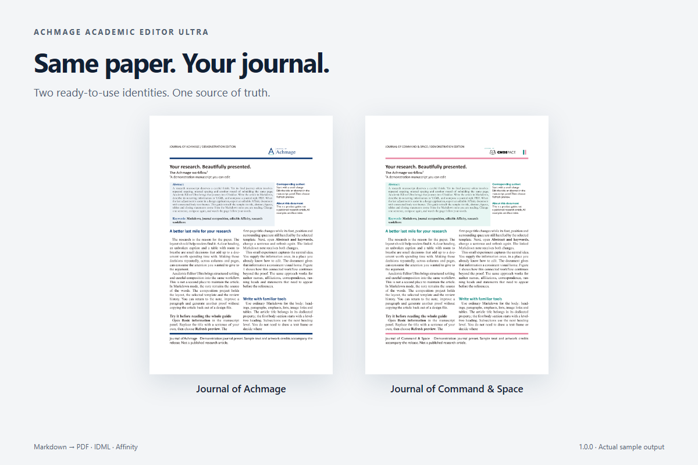
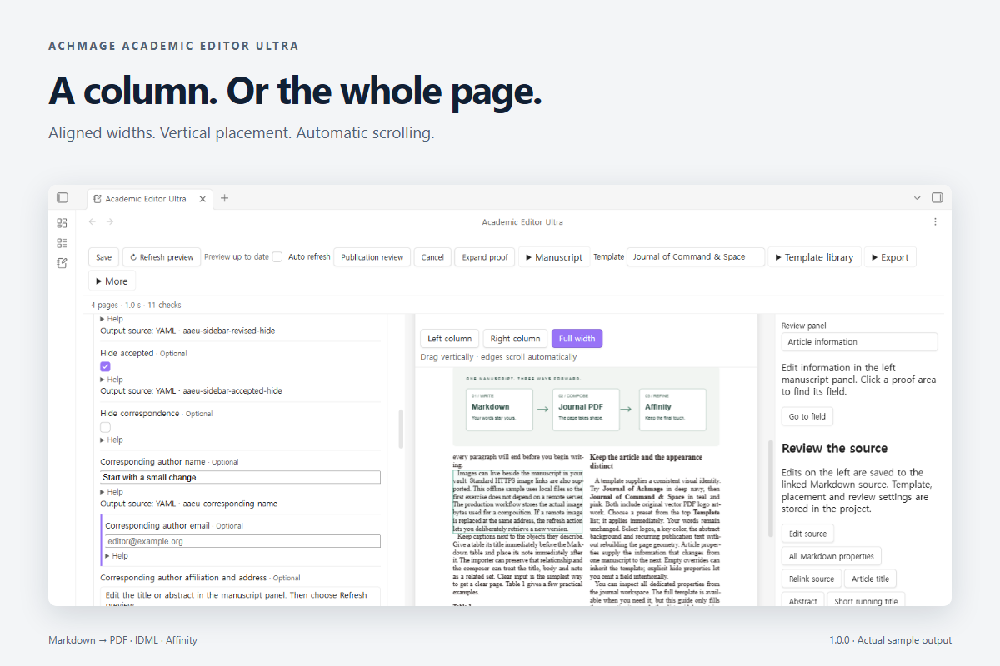
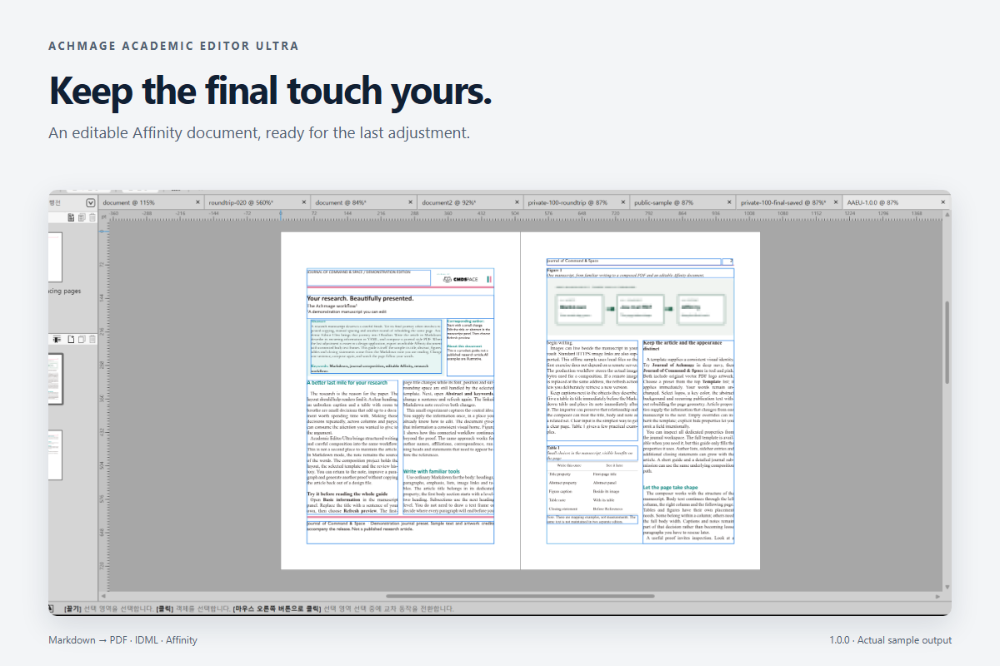

# Achmage Academic Editor Ultra

### Your words. A journal.

Write in Markdown. Compose a journal. Keep the last edit yours.



[한국어](README.ko.md) · [Download 1.0.0](https://github.com/laguna821/achmage-academic-editor-ultra/releases/tag/1.0.0) · [Working samples](https://github.com/laguna821/achmage-academic-editor-ultra/releases/download/1.0.0/aaeu-working-samples-1.0.0.zip) · [90-second demo](docs/launch/videos.md)

An Obsidian plugin for researchers and editors who want a carefully composed paper without rebuilding every page by hand. Start with a Markdown note or an author's Word manuscript. Create a PDF, then export an editable Affinity document when the final adjustment belongs in a design application.

## The guide is a manuscript you can try

**1.0.0:** edit Word and Markdown beside the proof. Click a printed field to
edit it, switch templates instantly, and keep figures aligned to a column or the
full page width. Saving is automatic; **Refresh preview** puts composition under
your control. [Changes and verification](docs/launch/release-1.0.0.md).

[Watch in English](https://youtu.be/cMVZ1uaMRdk) · [한국어 영상](https://youtu.be/ObFFGrG0EB4).
The 90-second films show 0.1.1; the screenshots show 1.0.0.

Choose **Open sample manuscript**. Its working guide has an abstract, correspondence, figures, tables, notes and closing statements. Change its title in the manuscript panel and choose **Refresh preview**. The page follows your words.

English and Korean samples are included offline. Opening the guide again preserves your edits; **Create a fresh copy** starts another experiment.

[English manuscript](examples/welcome/en.md) · [한국어 원고](examples/welcome/ko.md) · [Navy PDF](https://github.com/laguna821/achmage-academic-editor-ultra/releases/download/1.0.0/achmage-en.pdf) · [Command & Space PDF](https://github.com/laguna821/achmage-academic-editor-ultra/releases/download/1.0.0/command-space-en.pdf) · [Editable AF example](https://github.com/laguna821/achmage-academic-editor-ultra/releases/download/1.0.0/command-space-en.af.zip)

## Write where you think



Use headings, paragraphs, emphasis, lists, image links and Markdown tables. YAML properties give recurring information a home: the abstract, authors, correspondence, dates, running heads and statements before the references. Local images, Obsidian embeds and HTTPS image links are supported.

**Markdown remains the source.** The journal project holds appearance, placement and review decisions. Author DOCX files use an editable import-and-review workflow instead.

## Same paper. Your journal.



Three public presets are included: **Academic Editor Ultra**, **Journal of Achmage** and **Journal of Command & Space**. Each also ships as a self-contained template ZIP; import or export it from **Template library**. Private journal presets belong to your local library.

Choose **Journal of Achmage** for deep navy, or **Journal of Command & Space** for teal and pink. Both include vector PDF logos. Duplicate a preset and use a short wizard to change logos, colors, fonts, running heads and publication text. The established composition rules stay consistent.

These are demonstration identities, not published research journals or university endorsements. [Artwork credits](assets/brands/README.md).

## Let the page take shape



Two columns, heading hierarchy, figure-caption placement, table width, repeated headers and notes are handled by the composition engine. APA-oriented checks and optional Crossref lookups bring uncertain details into review. Missing facts still need an editor's judgment.

## Keep the final touch within reach



PDF is the composed result. AF and IDML let you continue in a design tool. Supported AF output includes connected body text frames, separate objects, vector PDF artwork, facing pages, masters and page-number fields.

Affinity uses its own text engine: check line breaks and the final linked frame after editing. Unsupported export cases are reported. Changes in Affinity do not synchronize back to Markdown. The sample demonstrates supported features; it is not a promise of universal compatibility.

## Install

**1.0.0** is independent of HanMark. Community directory review is separate
from the GitHub release; use the release ZIP while the listing is being reviewed.

1. Download `achmage-academic-editor-ultra-1.0.0.zip` from [Releases](https://github.com/laguna821/achmage-academic-editor-ultra/releases/tag/1.0.0).
2. Extract its three files into `<vault>/.obsidian/plugins/achmage-academic-editor-ultra/`.
3. Reload Obsidian, enable **Achmage Academic Editor Ultra**, then choose **Open sample manuscript**.

Requires Obsidian 1.8.9+. Desktop is required for native AF export. Installed fonts are discovered on Windows, macOS and Linux; missing fonts can be substituted. Commercial fonts are not bundled. macOS CI is retained; macOS hardware was not tested for this release.

## Local by design

Composition and APA checks run locally without an AI service or AI tokens. Crossref queries and remote image retrieval use the internet. Remote images are stored as project snapshots; refreshing them is explicit. Optional sample and video downloads are separate from the plugin.

[Quick start](docs/quick-start.ko.md) · [Markdown properties](docs/markdown-properties.md) · [Blank manuscript](templates/journal-manuscript.md) · [Release media](docs/launch/README.md) · [Development evidence](docs/research/R-042-launch-package.md)

```sh
npm ci --ignore-scripts
npm run check
```

MIT. Built on HanMark. [License](LICENSE) · [Third-party notices](THIRD_PARTY_NOTICES.md). Brand artwork and demo music retain their respective credits and licenses.
