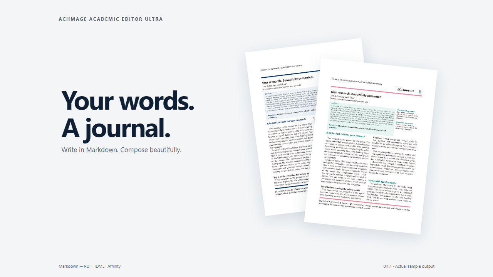
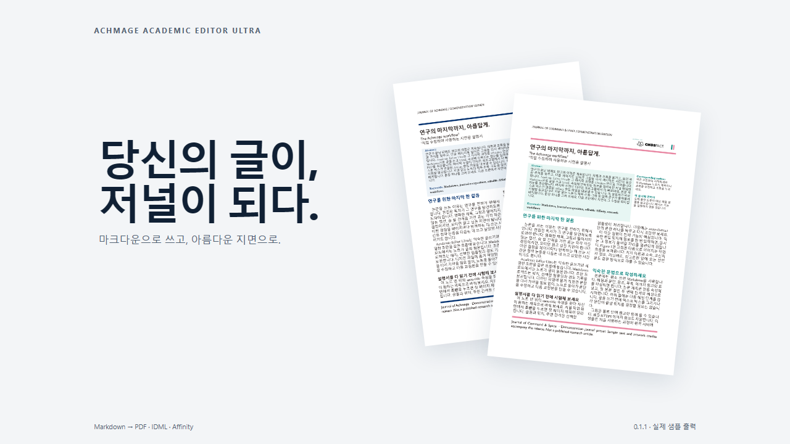

# See the workflow

English and Korean 90-second demonstrations show actual Markdown editing, composition, a custom journal change and a brief Affinity handoff. Each also has a 15-second teaser.

**[English · Your words. A journal.](https://youtu.be/cMVZ1uaMRdk)**

**[한국어 · 마크다운으로 쓰면, 저널이 된다](https://youtu.be/ObFFGrG0EB4)**

The downloadable MP4 files, SRT/VTT captions and gallery images belong to the [0.1.1 release](https://github.com/laguna821/achmage-academic-editor-ultra/releases/tag/0.1.1).

Dream Culture — Kevin MacLeod (incompetech.com), [CC BY 4.0](https://creativecommons.org/licenses/by/4.0/). Music is trimmed and faded. Waiting and file selection are shortened; application footage and exported documents are real.
