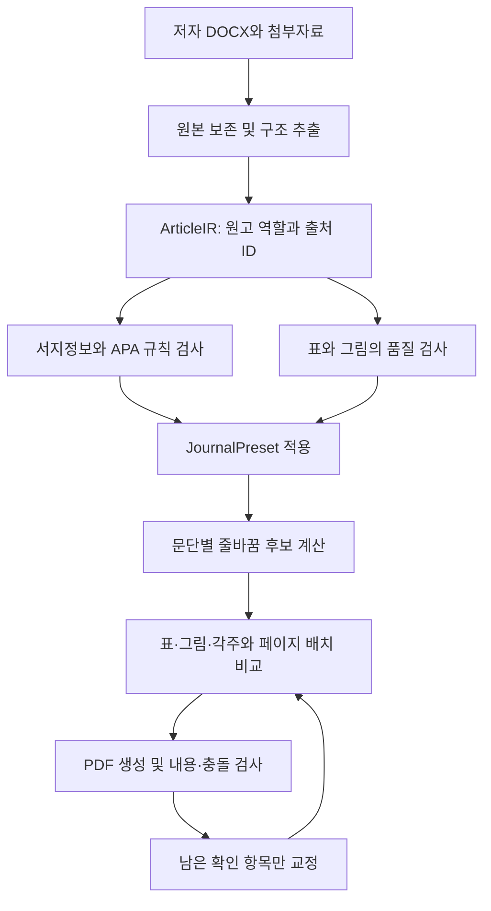

# R-018 — DOCX에서 시작하는 HNMR 저널 조판과 APA 7 자동화

- 상태: **조사 사실 CONFIRMED / 구현 설계 PROPOSED / 제품 미구현**
- 작성·갱신: 2026-09-16
- 코드 기준: HanMark 2.6.1, `a31a191d21cbb21e45d6ce76bdf187ca5b2502ff`
- 관련 연구: R-014의 배치 계약, R-016의 표 폭·분할, R-017의 배포 계약
- 이번 산출물은 별도 연구 폴더에 있다. 공개 2.6.1 소스·설정·브랜치·릴리스를 변경하지 않았다. 구현을 시작할 후속 버전에서 이 문서와 연구 장부를 함께 편입한다.

## 1. 결론

**AI 토큰 없이 자동화할 수 있는 범위가 크다. 다만 필요한 제품은 ‘2단 CSS 옵션 확대’보다 넓다. 저자 DOCX를 받아 구조와 참고문헌을 정리하고, 출판 품질을 검사하며, 문단·그림·표의 배치를 함께 계산하는 저널 제작 모드가 필요하다.**

사용자 확인 사항:

- 입력은 저자 DOCX다. 처음부터 정돈된 Markdown이나 완성 PDF를 전제로 삼지 않는다.
- 기존 PDF의 들쭉날쭉한 부분까지 그대로 복제할 필요는 없다. HNMR의 정체성을 유지하면서 하나의 일관된 기준으로 개선한다.
- 공간 활용을 중시한다. 본문은 읽는 순서를 유지하고, 그림·표는 허용된 범위에서 이동해 빈 공간을 줄인다.
- 참고문헌의 자료 종류·이탤릭·구두점, 그림 품질, 표 선, 캡션·헤딩의 제각각인 양식도 작업 범위다.
- 제품 실행 때 LLM/API 토큰을 쓰지 않는다. 온라인 서지 조회는 선택 기능이며, 로컬 조판과 별개다.

권고하는 핵심 구조는 **ArticleIR + JournalPreset + APA 규칙/서지 모듈 + 조판 엔진 + 교정 검사**다. ArticleIR은 원고의 의미를 보존한 중간 문서이며, JournalPreset은 저널의 외형과 배치 규칙이다. 정확한 원본 없이 사실·그림 세부를 추측하는 처리는 자동 완료로 표시하지 않는다.

## 2. 범위와 조사 방법

### PDF 조사 범위 — 완료

| 호 | Original Article | PDF 쪽수 | 제작 도구 메타데이터 |
|---|---:|---:|---|
| 10(1) | 8편 | 122쪽 | Affinity 3.2.2 |
| 9(2) | 4편 | 60쪽 | Affinity 3.0.2 |
| 9(1) | 10편 | 153쪽 | Adobe InDesign 20.4 Windows |
| 합계 | **22편** | **335쪽** | |

아카이브·호별 목록 HTML은 Original Article 선별과 PDF 주소 확인에만 사용했다. 논문 본문 웹페이지로 외형을 판단하지 않았다. Editorial·Book Review는 제외했다.

- PDF 22개를 내려받아 해시·페이지 수·메타데이터를 `corpus.json`에 기록했다.
- 335쪽 전체의 글꼴, 크기, 색, 좌표, 이미지 크기·배치, 재단 영역을 추출했다.
- 전체 페이지를 17장 연락판으로 렌더링해 육안으로 배치를 검토했다. 첫 페이지·전체 폭 표·그림 혼합·작은 표·참고문헌·인용문 등 12쪽을 추가 확대 검토했다.
- 이 검토는 **전체 페이지의 구조 조사 + 대표 난례의 확대 관찰**이다. 335쪽의 모든 글자·인용을 교정하거나 모든 참고문헌의 원출처를 검증한 것은 아니다.
- 원본 DOCX나 Affinity/InDesign 편집 파일은 이번 조사에 입력되지 않았다. PDF만으로 원래 스타일 이름, 텍스트 박스 설정, 수동 편집의 정확한 이력을 복원할 수 없다.

증거 파일: [22편 목록과 쪽별 관찰](corpus-review.md), [전체 연락판/자료 탐색](index.html), [측정치](analysis/measurements.json), [원시 좌표](analysis/pages.json), [글자 간격 연산자 표본](analysis/text-transforms.json).

### APA 조사 범위 — 공개 자료 + 실행 시험

사용자가 지정한 [Purdue APA 7 가이드](https://owl.purdue.edu/owl/research_and_citation/apa_style/apa_formatting_and_style_guide/index.html), CSL의 APA 7 스타일 소스, Zotero·citeproc 공식 문서를 대조했다. APA Style 공식 개별 페이지와 무료 reference-guide PDF는 이번 도구에서 본문을 반환하지 않았다. **유료 Publication Manual 전문을 열람하거나 모든 조항을 대조한 것으로 주장하지 않는다.**

따라서 이번 결론은 ‘실행 가능한 규칙 기반 자동화 설계’다. 제품이 지원한다고 명시할 APA 규칙 각각에는 근거·입력 전제·예외·검증 예제를 붙이고, 원문 매뉴얼의 해당 조항을 확인한 범위만 적합성 목록에 포함해야 한다.

## 3. PDF에서 확인한 디자인과 적용 방향

### 3.1 측정된 값과 제안하는 값은 다르다

| 요소 | PDF에서 확인된 관찰 | 새 프리셋 방향 |
|---|---|---|
| 판형 | 재단 기준 약 **182 × 257mm**. 9(2)는 182.033 × 257.048mm. 9(1)·9(2)에 약 3mm 재단 바깥 영역 | B5 계열 182 × 257mm를 명시. A4를 축소해 흉내 내지 않음 |
| 본문 | Times New Roman 10pt, 일반 본문에서 **12pt 기준선 간격**이 가장 빈번 | 동일 글꼴 사용 가능 여부 확인 후 10/12pt에서 시작 |
| 가로 영역 | 대표 본문 왼쪽 시작 56.69pt≈20mm, 오른쪽 시작 약262.6pt. 한 단 약70mm | 정확한 복제용 좌표와 새로운 통일 프리셋을 구분 |
| 단 사이 | 대표 텍스트 프레임 추정 약2.4mm. 끝 공백·문장부호에 따라 실제 보이는 여백이 더 넓음 | 사용자의 ‘너무 붙지 않게’ 요구를 반영해 **신규 통일안은 4mm를 시험값**으로 사용. 역사적 PDF 관찰치와 혼동하지 않음 |
| 제목 | 10(1) 15pt Calibri Bold. 9(1) 16pt. 9(2) 주로15pt, 13pt 예외 | 최신 호 기준15pt/18pt에서 시작. 길면 줄을 늘리고 임의 자동 축소는 제한 |
| 초록 | 10(1) Garamond8.3pt/약9.13pt. 9(1)9pt도 다수 | 최신 외형을 기준으로 설정하되 가독성용9pt 대안은 교정 비교 |
| 초록 패널 | 10(1) 대표 패널 약104.3mm 폭, 내부 왼쪽 패딩 약3mm. 옆에 접수·수정·게재승인·교신저자 | 높이는 내용에 따라 계산. 긴 저자·소속·초록 처리 필요 |
| 키 컬러 | 대표 헤딩 `#00663e`; 본문 `#231916`; 초록 배경의 PDF 변환 RGB 약`#f0f1f1` | 의미별 색 토큰. 색공간·ICC 변환에 따른 RGB 차이 기록 |
| 대제목 | 대표 Calibri Bold12pt 녹색 | 명시적 역할 스타일 |
| 하위 제목 | 대표 Times New Roman Bold11pt; 다른 단계·인용·이어쓰기 변형 존재 | 의미상의 수준과 출력 모양을 분리 |
| 참고문헌 | TNR9·10pt 혼재, 10pt에서도 약10.42pt 또는12pt 간격. 내어쓰기 약10mm 또는12.7mm 사례 | 한 프리셋에서 통일. APA 인용 규칙과 저널의 본문 크기·행간 계약을 별도로 명시 |
| 표·그림 | 한 단/전체 폭 모두 있음. 작은 숫자표·긴 설명표·여러 그림이 한 페이지에 섞임 | 종류·정보 밀도·읽을 수 있는 최종 크기로 폭과 위치 결정 |

대표 근거: [10(1) 23–35쪽 논문 PDF](https://hnmr.org/upload/pdf/hnmr-2026-00094.pdf#page=1), [9(1) 1–20쪽 논문 PDF](https://hnmr.org/upload/pdf/hnmr-2025-00052.pdf#page=10). 상세 표본의 좌표와 값은 로컬 측정 파일에 남겼다. 글자 추출 좌표는 프레임·기준선 추정이며 폰트의 실제 검은 획 경계와 같지 않다.

### 3.2 그대로 복제하지 않을 편차

사용자가 확인한 것처럼 출판본 사이에 캡션 위치, 표 선, 링크 외형, 마지막 단의 높이 등이 다르다. 일부 표 안에는 PDF상 약3–5pt로 추출되는 작은 글자도 있다. 이 값을 새로운 최소 글자 크기로 채택하지 않는다.

- [9(1) PDF10쪽](https://hnmr.org/upload/pdf/hnmr-2025-00052.pdf#page=10)의 전체 폭 그림·표와 그 아래 2단 본문은 필수 배치 사례다.
- [10(1) PDF7–9쪽](https://hnmr.org/upload/pdf/hnmr-2026-00129.pdf#page=7)의 여러 캡션·스크린샷·표는 개체 묶음과 빈 공간 활용 시험이다.
- [10(1) PDF6–10쪽](https://hnmr.org/upload/pdf/hnmr-2026-00122.pdf#page=6)의 다층 표 머리행·긴 설명·통계 기호는 표 재구성 시험이다.
- [9(2) PDF10쪽](https://hnmr.org/upload/pdf/hnmr-2025-00213.pdf#page=10)의 인용문·화자 표시·이어쓰기 제목은 문서 의미 보존 시험이다.

일부 래스터 배치에서는 최종 유효 해상도가 약179dpi였다. 이것은 ‘원본 파일의 dpi 태그’와 다르다. 소스 픽셀 수를 PDF 안에서 놓인 실제 길이로 나눈 값이다. 각 배치가 독립된 완성 Figure라는 뜻은 아니다. [해당 PDF13쪽](https://hnmr.org/upload/pdf/hnmr-2026-00164.pdf#page=13)

**디자인 목표:** 최신 HNMR의 머리말·서체 계열·녹색·초록 구성을 기본으로, 표/그림·캡션·참고문헌·단 정렬을 문서 전체에서 통일한다. ‘어느 기존 쪽과 픽셀까지 같게’보다 ‘합의한 프리셋을 모든 원고에 일관되게 적용’하는 것이 목표다.

## 4. APA 7 자동화: 어떤 부분까지 가능한가

### 4.1 참고문헌은 서지정보에서 다시 생성한다

저자가 붙여놓은 이탤릭을 고치는 작업보다, 각 문헌을 `type / author / issued / title / container-title / volume / issue / page / DOI …`로 보존한 후 규칙으로 다시 출력하는 방식이 안전하다. 자료 종류가 결정되면 역할별 서식은 반복 가능한 계산이다.

| 자료/상황 | 자동 출력 또는 검사 | 필요한 전제 |
|---|---|---|
| 학술지 논문 | 논문 제목은 일반체, 학술지명·권은 이탤릭, 호는 일반체 | 자료 종류, 권·호 구분 |
| 단행본 | 책 제목 이탤릭, 판 정보·출판사 배치 | 책 전체 인용인지 확인 |
| 편저서의 장 | 장 제목·편집자·책 제목·쪽 범위의 역할별 출력 | 장 저자와 편집자, 책 제목 구분 |
| 보고서·웹페이지 | 독립 저작물 제목/발행기관/웹사이트 등 유형별 처리 | URL이 있다고 모두 웹페이지로 분류하지 않음 |
| 저자 수 | 20명까지 전원,21명 이상은 앞19명과 마지막 저자 | 전체 저자 목록 보유 |
| 같은 저자·같은 연도 | 참고문헌 정렬과 본문 인용의 a/b 동시 갱신 | 본문 인용과 레코드 ID 연결 |
| DOI·URL | DOI URL 형식, 불필요한 중복·잘린 링크 검사 | 식별자 사실 검증은 별도 |
| 내어쓰기·줄바꿈 | 항목별 내어쓰기, 링크 의미를 보존한 표시용 줄바꿈 | 글자에 임의 공백/하이픈을 삽입하지 않음 |

규칙 근거: [Purdue 기본 규칙](https://owl.purdue.edu/owl/research_and_citation/apa_style/apa_formatting_and_style_guide/reference_list_basic_rules.html), [학술지](https://owl.purdue.edu/owl/research_and_citation/apa_style/apa_formatting_and_style_guide/reference_list_articles_in_periodicals.html), [책·편저서의 장](https://owl.purdue.edu/owl/research_and_citation/apa_style/apa_formatting_and_style_guide/reference_list_books.html). URL과 검색일은 모든 문헌에 일괄 첨부하지 않는다. 데이터베이스 자료와 변하는 웹페이지에는 별도 조건이 있다. [전자 자료 규칙](https://owl.purdue.edu/owl/research_and_citation/apa_style/apa_formatting_and_style_guide/reference_list_electronic_sources.html)

### 4.2 원출처 복원은 별도의 문제다

우선순위:

1. DOCX의 Zotero/Word/EndNote 인용 필드와 별도 RIS·BibTeX·CSL JSON에서 구조화된 정보를 읽는다. 필드 형식별 지원 범위를 명시한다.
2. DOI가 있으면 사용자 선택에 따라 Crossref/DataCite 등의 식별자 조회를 실행한다. 원문과 조회 결과의 저자·연도·제목·종류가 충돌하면 덮어쓰지 않고 차이를 표시한다.
3. 식별자가 없으면 로컬 서지 캐시와 규칙 파서를 적용한다. 제목 검색은 후보 제시용이다. 검색 1위를 자동 확정하지 않는다.
4. 종류 불명, 책/장 모호, 저자 목록 생략, 제목 대소문자 불명 등은 해당 항목만 확인한다. 한 번 확인한 결과는 문헌 ID와 근거를 붙여 재사용한다.

Crossref는 등록 기관이 제공한 메타데이터를 공개 API로 반환한다. 메타데이터 자체가 불완전할 수 있으므로 출력 규칙 엔진과 ‘사실 확인됨’ 상태는 구분해야 한다. [Crossref REST API](https://www.crossref.org/documentation/retrieve-metadata/rest-api/)

특히 **모두 대문자로 받은 제목을 완벽한 sentence case로 바꾸는 일은 문법 치환만으로 끝나지 않는다.** AI, 나라·사람 이름, 브랜드, 종명 등은 보존해야 한다. 신뢰할 원출처 표기를 우선하고, 보호할 단어 사전과 수정 제안을 사용한다. Zotero도 이 변환의 100% 신뢰성을 보장하지 않는다고 설명한다. [Zotero 제목 대소문자 설명](https://www.zotero.org/support/kb/sentence_casing)

`n.d.` 역시 ‘저자가 연도를 빠뜨림’을 감추는 값으로 사용하면 안 된다. 실제 무연도 자료임이 확인됐는지, 아직 연도를 찾지 못했는지를 분리한다. 레코드마다 원문·필드별 출처·정정 이력·미확인 이유를 보존한다.

### 4.3 실제 로컬 시연 결과 — 완료

[APA 출력 시연](apa-spike/proof.html) · [입력 13개](apa-spike/records.json) · [결과와 확인 항목](apa-spike/results.json)

- `citeproc 2.4.63` + APA Style 7th edition CSL.
- CSL 고정 커밋 `32078ede72b9224e1ed02c546668e20ee7c75585`, 파일의 갱신 표기2026-02-07. 스타일·locale SHA256 기록.
- 가상의 학술지 논문·책·편저서 장·보고서·웹자료·저자 수·연도 중복 등13개를 실행.
- **20/20 동작 확인**: 16개는 서식·재현성 확인,4개는 결함·한계 재현이다. 대문자 미교정, 불완전 정보 출력, 단체 이름 중복, 조회 날짜 없이 Retrieved 문구가 나오는 경우를 재현했다. APA 적합성20개 항목을 통과했다는 의미가 아니다.
- 렌더링 스크립트에는 네트워크 호출·LLM 호출이 없다. 의존성과 스타일을 취득한 뒤 로컬에서 실행했다.
- 이것은 구조화된 입력의 서식 실행 가능성 시험이다. 실제 DOCX 가져오기·원출처 조회·모든 APA 예외의 적합성을 증명한 것은 아니다.

**시연에서 추가로 발견한 문제:** 단체 저자와 사이트명이 같은 웹자료도 중복 출력됐으며, 변동 가능한 대시보드에서 조회 날짜가 없어도 `Retrieved`가 붙었다. Purdue는 동일 저자/사이트명 생략과 변동 자료의 조회 날짜를 설명한다. 따라서 원본 서지정보를 보존한 채 출력용 데이터에서 확인된 동일 기관을 처리하고, 필요한 조회 날짜가 없으면 미완료로 표시하는 규칙이 추가되어야 한다. 보고서의 동일 저자/발행기관 처리도 유형별 적합성 시험에 포함한다. 이 시연에는 결함을 숨기지 않고 원시 출력과 경고를 함께 남겼다. [Purdue 전자자료 규칙](https://owl.purdue.edu/owl/research_and_citation/apa_style/apa_formatting_and_style_guide/reference_list_electronic_sources.html)

CSL은 인용·참고문헌을 만드는 규칙 언어다. 표 선, 그림 해상도, 문단 배치, 원고 내용의 정확성까지 검사하는 도구가 아니다. [CSL 개발자 문서](https://citationstyles.org/developers/) · [시험한 APA 스타일](https://github.com/citation-style-language/styles/blob/32078ede72b9224e1ed02c546668e20ee7c75585/apa.csl) · [citeproc 실행 API](https://citeproc-js.readthedocs.io/en/latest/running.html)

### 4.4 본문 인용·표·그림·헤딩 검사도 필요하다

**제안하는 추가 규칙:**

- 본문 인용↔참고문헌의 ID 연결, 빠진 문헌·중복·연도 불일치·저자 철자 차이·직접 인용 locator 확인. 개인적 의사소통 등 목록에 들어가지 않는 예외를 구분한다.
- Figure/Table 번호와 본문 언급을 연결해 번호 중복·누락·언급 순서를 검사한다. `Figure 1`이라는 문자열 전체를 무차별 치환하지 않는다.
- 표/그림 번호·제목·본문·범례·주석을 별도 노드로 저장한다. APA 형식은 번호 굵게, 제목 이탤릭, 그림 위에 번호와 제목. 주석은 일반/특정/확률 순서로 구성한다. 표는 필요한 가로선 중심으로 통일한다. [Purdue 표·그림](https://owl.purdue.edu/owl/research_and_citation/apa_style/apa_formatting_and_style_guide/apa_tables_and_figures.html)
- 그리기 가능한 Figure의 내부 글자는 sans serif8–14pt 범위를 규칙 근거로 검사한다. 래스터에서 내부 글자 크기를 확실히 읽지 못하면 ‘검사 불가’로 표시한다. 해당 근거는 위 가이드에 있다.
- 헤딩1–5의 위계를 지원하고4·5단계의 ‘제목 다음 같은 줄에서 본문 시작’도 표현한다. DOCX에서 단순 bold 문장을 무조건 헤딩으로 바꾸지 않는다. [Purdue 헤딩](https://owl.purdue.edu/owl/research_and_citation/apa_style/apa_formatting_and_style_guide/apa_headings_and_seriation.html)
- `p`, `M`, `SD`, 신뢰구간, 각주 기호의 표기를 역할로 분류해 검사할 수 있다. 수치 자체·유의성·소수점 정밀도를 임의 변경하지 않는다. 숫자 오류와 스타일 오류를 구분한다.

### 4.5 APA 원고 형식과 HNMR 출판 형식을 명시적으로 구분

APA 원고의 두 줄 간격·새 페이지 References·가운데 정렬 대제목 등을 모두 강제하면 HNMR의 현재 출판 외형과 달라진다. 하나의 버튼을 ‘APA 7 완전 준수’라고 표시해 이 충돌을 숨기면 안 된다.

- **HNMR 출판 프로필:** HNMR 판형·서체·행간·녹색 헤딩 + APA7 인용/참고문헌/캡션 규칙. 저널이 달리 정한 항목은 house-style override로 명시한다.
- **APA7 원고 프로필:** 원고 제출용 페이지·행간·헤딩 규칙. 후속 별도 프로필로 확장 가능하다.
- 맞춤 저널은 `규칙 상속 → 명시적 예외 → 예외 사유`를 저장한다. 조판 담당자가 원고마다 머릿속으로 예외를 기억하지 않게 한다.

## 5. 저자가 제각각 보내는 DOCX를 다루는 방법

### 5.1 현재 소스에서 확인한 부족한 경계

`src/io/kordocImport.ts:132`의 가져오기는 `parse(arrayBuffer)` 후 `result.markdown`과 이미지를 Vault 노트로 저장한다. 현재 사용 경로는 저널 의미를 보존하는 ArticleIR 저장 경로가 아니다.

`editorialDocument.ts`에는 일반 문단·헤딩·표·인용·목록 등이 있지만, 저자/소속 관계, 초록, 인용 레코드 ID, Figure와 캡션의 결합, 다층 표 머리행·각주 같은 저널 전용 모델이 없다. 따라서 변환된 Markdown에서 다시 의미를 추측하기보다 DOCX 정보를 잃기 전에 확보해야 한다.

### 5.2 DOCX에서 보존할 정보

- `document.xml`, `styles.xml`의 문단·문자 스타일과 상속, `numbering.xml`의 목록 구조.
- `w:pStyle`, outline 수준, keep-with-next, 줄바꿈·섹션 구분. 저자의 외형은 의미 추출의 단서로 사용한다.
- `instrText`, `fldSimple`, bookmarks, content controls의 인용·상호참조·캡션 필드. Zotero 필드 존재는 공식 문서로 확인된다. [Zotero Word 필드](https://www.zotero.org/support/kb/word_field_codes)
- 병합된 셀, 다층 머리행, 셀 안 문단·이미지·각주, 단위와 숫자 값.
- `word/media`, DrawingML 이미지 관계, chart XML 및 내장 workbook, 도형 그룹·텍스트박스·VML·OLE 대체 이미지.
- 각주·미주, 수식(OMML), 첨자, 링크, 다국어·RTL, 변경 추적. 변경 추적이 남으면 최종/원본 중 어느 뷰를 쓸지 문서 상태로 고정한다.

DOCX는 여러 part와 관계를 가진 패키지다. 단순 본문 문자열로 취급할 수 없다. [Microsoft WordprocessingML 구조](https://learn.microsoft.com/en-us/office/open-xml/word/structure-of-a-wordprocessingml-document)

가져오기 결과는 `확정된 구조 / 매핑 제안 / 가져오지 못한 요소`로 보여준다. 예를 들어 저자가 만든 ‘Heading Blue’ 스타일을 H2로 한 번 지정하면 같은 원고 전체에 적용한다. 애매한 것을 모두 H2로 확정하거나 모든 수동 서식을 지우지 않는다. 강조·종명·변수의 이탤릭은 본문 의미일 수 있다.

### 5.3 그림은 원본 형태에 따라 자동화 수준이 달라진다

| 입력 상태 | 가능한 자동 처리 | 남는 확인 |
|---|---|---|
| DOCX의 진짜 표 | 내용·병합을 보존하고 열 폭·선·패딩·서체 재구성 | 의미 불명 머리행·통계 표기 |
| 표의 스크린샷 | 해상도·폭·캡션 검사 | 셀 데이터 복원. 조용한 OCR 변환을 확정값으로 쓰지 않음 |
| 차트 XML + 데이터 | 지원 차트 유형을 벡터로 재출력, 폰트·색·선 통일 | 축·단위·오차막대·범례·계열·원본 값의 동등성 |
| SVG/PDF 벡터 | 고해상도 배치, 일부 구조 검사 | 경로로 바뀐 글자·임의 도형의 의미. 모든 벡터가 편집 가능한 데이터는 아님 |
| Word 도형 그룹 | 지원 도형·화살표·텍스트를 재구성할 후보 | 복잡한 SmartArt/수식/레이아웃은 별도 지원 |
| PNG/JPEG | 종횡비·유효dpi·캡션·배치 검사 | 원래 세부 정보가 부족하면 고해상도 원본 필요 |

저화질 사진을 단순 확대·샤프닝해 ‘고해상도 해결’로 표시하지 않는다. 기존 그림이 불분명한 경우에는 저자에게 필요한 자료를 구체적으로 알려주는 요청서 초안을 생성할 수 있다. 이번 작업에서 이메일을 발송하지 않는다.

**제안하는 해상도 정책:** 사진300dpi, 선화600dpi를 초기 저널 기준으로 시험한다. 이는 이번 설계의 출판 품질 목표이며 ‘모든 APA Figure에 정해진 단일 dpi’라는 주장이 아니다. 유효dpi는 `픽셀 ÷ (최종 mm / 25.4)`로 계산한다. 폭70mm에는300dpi 기준약827px, 폭142mm에는약1678px가 필요하다. 읽을 수 있는 최소 라벨 크기와 함께 평가한다.

차트 통일은 우선 막대·선·산점도·오차막대처럼 지원 범위를 정한다. 모형도·SEM 경로도·SmartArt를 처음부터 모두 자동 재제작한다는 약속은 피한다. 원본의 축 범위·색의 의미·선 종류·값을 바꾸는 재디자인은 별도 변경 기록이 필요하다.

## 6. ‘단정하고 꽉 찬 페이지’를 만드는 계산

### 6.1 현재 HanMark와 다른 문제

`editorialPdfFlow.ts`는 본문170mm, 높이252.9mm를 고정하고 DOM에서 측정한 높이로 분할한다. 현재 페이지와 가까운 그림 배치 후보를 고르는 방식이다. `editorialPdfMeasure.ts`는 브라우저가 만든 줄을 읽어 분할한다. 문단 전체의 여러 줄바꿈 후보를 비교하는 조판기는 없다.

전문 조판에서는 ‘이 문단을 한 줄 줄이면 아래 제목과 표가 같이 들어가는가’를 함께 계산해야 한다. 단순 `text-align: justify`, `column-count: 2`, 높이 맞추기만으로는 이 결정을 표현하기 어렵다. CSS가 정의하는 간격·줄바꿈 기능과 실제 엔진의 지원은 구분해서 시험해야 한다. [W3C CSS Text3](https://www.w3.org/TR/css-text-3/)

### 6.2 제안하는 처리 순서

1. **문단 조판:** 단어·하이픈 후보·여백을 이용한 문단 전체 최적화(Knuth–Plass 계열). 글자 모양과 커닝은 shaping 엔진에 맡기고, 원본 문자를 보존한다.
2. **여러 후보:** 동일 문단에 대해 정상 간격, 제한된 tracking, 허용된 하이픈 정책 등에서 줄 수가 다른 후보를 만든다. 단어 간격의 불균일과 연속 하이픈에 비용을 준다.
3. **공통 기준선:** 본문 줄은 같은12pt 기준선에 놓는 안부터 시험한다. 제목·인용·표 끝에서 다음 기준선으로 복귀할 간격을 계산한다.
4. **페이지 후보:** 그림/표 한 단·전체 폭, 위·아래·필요시 중간 가로 띠, 다음 페이지 등 가능한 조합을 비교한다. 중간 전체 폭 띠는 위쪽2단 영역을 마친 후 아래쪽2단 영역으로 이어지는 읽기 순서를 명시한다.
5. **한정된 앞보기:** 우선2–4쪽을 함께 검토하는 beam search를 시험한다. 후보 수·반복 수·시간을 제한하고 안정적인 동률 처리로 같은 입력에 같은 배치를 만든다. 무한 전역 탐색은 피한다.
6. **마지막 단:** 본문 영역·절 경계·마지막 페이지의 허용 예외를 구분한다. 마지막 페이지의 빈 공간을 무조건 늘어난 자간·행간으로 메우지 않는다.

### 6.3 무엇을 우선하는가

**하드 제약:** 내용 누락·중복 없음, 본문 순서 유지, 표 행 순서·열 관계 유지, 글자/셀/캡션 겹침 없음, 최소 글자 크기, 허용 이미지 크기, 제목 고립 방지, 각주 연결, 원본 출처 추적.

**비용을 줄일 항목:** 비정상적으로 큰 단어 간격, 연속 하이픈, 외톨이 줄, 좌우 단 하단 차이, 쓸데없는 빈 공간, 원문 언급과 그림 사이 거리, 연속 페이지의 서체/간격 변화, 불필요한 페이지 증가.

밀도를 최대화하는 한 가지 점수만 쓰면 읽을 수 없는 표·밀린 각주·잘못된 읽기 순서를 고를 수 있다. 유효 후보를 먼저 걸러낸 다음 가독성과 밀도를 비교한다. 길고 안 맞는 항목은 이유와 대안을 보여준다.

**초기 시험 범위(APA 규칙도, PDF에서 추출한 규격도 아님):** tracking ±0.01em, 단어 간격은 선호 범위 안에서 조정, 연속 하이픈 최대2줄. 글리프 가로 확장은 기본 끄고, 필요시98–102% 후보를 별도 시험한다. 글자 세로 배율은100%를 유지한다. 문단 spacing·그림 간격을 조정할 때도 공통 기준선과 최소 간격을 보존한다.

세로 글자를 눌러서 줄 높이를 맞추거나, 완성된 텍스트 박스 전체에 CSS transform을 걸어 흐름 높이와 실제 획 경계가 달라지게 하는 방식은 피한다. 제한된 간격 조정으로 해결되지 않는 페이지는 명시적 예외로 남긴다.

### 6.4 표와 그림의 배치 계약

- A/B는 기존 그림 정책으로 유지. 새 저널 모드는 개체별 `auto / column / full`과 예외 지정이 가능하다.
- 표는 **원본 보존 → 가독성 있는 두 폭 비교 → 열 폭 고정 → 행 분할 → 캡션/주석과 배치** 순서다.
- 표 번호·제목·첫 머리행을 함께 배치한다. 분할 조각에는 머리행 반복, continued 표기, 열 폭과 행 ID를 유지한다. 주석이 마지막 조각 밖으로 잘리지 않도록 계산에 포함한다.
- 원문 언급에서 첫 조각까지 한 페이지 이내 시작을 기본으로 하고, 긴 표의 이후 조각은 연속 배치한다. 실제 불가능한 경우 이유를 표시한다.
- Figure 내부 여러 패널은 하나의 그룹이다. 각각의 축척·순서·(a)(b) 라벨을 보존한다. 캡션·범례·주석을 분리해 떨어뜨리지 않는다.
- 표/그림 주변 최소 간격4mm를 초기값으로 사용하되 페이지 그리드와 양립하는 방법을 시험한다.
- 참고문헌에서는 URL을 해석 가능한 원문 문자열로 보존하고, 표시용 줄바꿈과 PDF 링크 대상을 분리한다.

## 7. 엔진 후보와 결정 방법

| 후보 | 확인된 장점 | 이 요구에서 남는 작업 | 권고 |
|---|---|---|---|
| 현재 Chromium/DOM 조판 확대 | 기존 미리보기·표 측정·출력과 가깝다 | 문단 줄바꿈 후보, 미세조정, 전역 기준선·마지막 단 균형을 직접 만들어야 함 | 기존 모드 유지. 비교 기준 |
| Typst + 로컬 WASM 어댑터 | 최적화 줄바꿈, 하이픈·tracking·overhang, 단을 가로지르는 float 지원 | 기본 columns는 높이 균형을 지원하지 않음. 복합 표 연속·기준선·자간 후보 탐색·WASM 자원/폰트/용량 검증 | **우선 실험할 후보**, 채택 확정 아님 |
| Vivliostyle | CSS 페이지 float·독립 다단 구현·각주 등 출판 기능 | 지원 범위 제약, 문단 미세조판과 전역 최적화 품질 실측 필요 | 두 번째 비교 후보 |
| Paged.js | HTML/CSS 페이지 분할·머리말·확장 훅 | 이 기능만으로 문단 품질과 복잡한 float 최적화가 해결됐다고 볼 수 없음 | HTML 기반 대안 |
| LuaLaTeX + microtype | 미세조판 기능과 성숙한 생태계 | 설치·엔진/폰트 배포·OS 실행·플러그인 경계 부담 | 품질 비교 기준 또는 선택형 외부 출력기 |
| 새 JS/WASM 조판기 전체 작성 | 모든 제약과 진단을 직접 제어 | shaping·Bidi·수식·PDF·폰트·줄바꿈까지 재구현 비용이 매우 큼 | 기존 엔진의 실측 부족점이 확정된 뒤 필요한 계층만 작성 |

중요한 확인: Typst의 `text(stretch)`는 가까운 condensed/expanded 폰트를 선택하는 속성이다. 임의의 글리프 폭을 자동으로 ±2% 미세 확장하는 기능과 동일하지 않다. `columns`는 공식 문서상 높이 균형을 아직 지원하지 않는다. [Typst text](https://typst.app/docs/reference/text/text/) · [columns](https://typst.app/docs/reference/layout/columns/) · [전체 폭 float](https://typst.app/docs/reference/layout/place/)

브라우저 연동 후보 `typst.ts`는 Typst 공식 코어와 별도 프로젝트다. 버전 대응, WASM 크기·메모리·출력 API·폰트 주입·로컬 파일 경계를 실제로 검증해야 한다. [typst.ts](https://github.com/Myriad-Dreamin/typst.ts)

Vivliostyle의 root multicol, column-span/page float 제약은 지원 표에 명시돼 있다. [지원 CSS](https://docs.vivliostyle.org/en/reference/supported-css-features/) · [Paged.js 문서](https://pagedjs.org/en/documentation/) · [microtype 기능](https://www.ctan.org/pkg/microtype)

**채택 전 실험:** 같은 ArticleIR·같은 폰트·같은 여백으로 (1)조밀한 본문 (2)전체 폭 그림+표 (3)긴 표+각주 (4)APA 참고문헌과 긴 DOI의 네 난례를 후보 엔진에 넣는다. 기본 렌더링과 필요한 추가 최적화의 구현량을 함께 비교한다. 이번 조사에서는 엔진별 PDF 성능 비교를 실행하지 않았다.

## 8. 설정과 편집 화면

### JournalPreset의 역할

기존 테마 JSONv1에 수십 개 설정을 임의로 끼워넣지 않고, 저널 전용 버전 스키마를 만든다. 색·서체뿐 아니라 적용할 수 있는 범위와 검증 조건을 저장한다.

- 판형·재단·여백, 첫 페이지/홀수/짝수/전체 폭 페이지 마스터.
- 로고·저널명·ISSN·DOI·권호·시작 쪽수·running title·권리 문구.
- 저자/소속/교신저자, 접수·수정·승인일, 초록·키워드 영역.
- 본문·각주·블록 인용·참고문헌·헤딩1–5·캡션의 글꼴/크기/행간/들여쓰기/전후 간격/keep 조건.
- 표 종류별 머리행·선 굵기·셀 패딩·소수점 정렬, Figure 지원 유형별 색·선·폰트.
- 단 간격·그리드·float 이동 허용 범위·최소 글자 크기·표 분할·해상도·APA override.

일반 사용 화면은 `저널 프리셋 선택 → DOCX 가져오기 → 확인 필요한 항목 → 교정본`으로 단순하게 만든다. 세부 규칙은 고급 프리셋 편집기에 둔다. JSON 템플릿은 검증된 선언형 데이터로 제한한다.

### 확인 화면이 보여줄 것

‘경고47개’를 나열하는 대신 같은 이유의 항목을 묶어 실제 해결안을 준다.

- **참고문헌:** “책 전체/책의 장 구분 필요” → 원문·조회 후보·출력 전후 표시.
- **그림:** “전체 폭에서179dpi, 한 단에서는 충분” → 선택 가능한 폭과 원본 요청 옵션.
- **구조:** “이 사용자 스타일12곳을 H2로 적용” → 전체 미리보기 후 같은 매핑 재사용.
- **조판:** “긴 URL 때문에 한 줄 증가” → 합법적인 줄바꿈/전체 폭/페이지 이동 대안.

각 자동 수정은 규칙 ID, 입력 근거, 바뀐 항목을 남긴다. ‘서식 통과 / 서지정보 확인 필요 / 검사할 수 없음’이 서로 다른 상태다. 확인을 마친 항목은 다음 출력에서 다시 묻지 않는다.

## 9. 구현 단계와 종료 조건

기간을 단정하기보다 단계별 산출물과 합격 기준을 먼저 정한다. 아래 단계는 같은 제품의 의존 순서이며, 아직 개발 착수·버전 승인이나 배포 완료를 뜻하지 않는다.

| 단계 | 구현 묶음 | 다음 단계로 갈 조건 |
|---|---|---|
| P0 | 근거 코퍼스·통일 프리셋 초안·엔진 비교 실험 | 폰트·판형·본문/캡션/APA override 기준 고정; 네 난례의 엔진 선택 기록 |
| P1 | DOCX→ArticleIR, 원본/관계/미지원 요소 목록 | 실제 저자 DOCX에서 문단·표 셀·인용·그림 누락 검증; 불명 구조만 확인 |
| P2 | 서지 데이터 모델·APA 출력·검증·로컬 캐시 | 유형별 골든 테스트, 인용↔문헌 연결, 같은 연도·저자 수·불완전 정보 시험 |
| P3 | HNMR 마스터·기준선·문단 후보·표/그림 페이지 탐색 | 겹침/누락0, 그림과 표 주석 보존, 조밀한 본문과 전체 폭 난례 합격 |
| P4 | 표 통일·지원 차트 벡터 재출력·해상도 검사 | 값·단위·축·범례 보존; 미지원 자료를 성공으로 표시하지 않음 |
| P5 | 커스텀 저널 편집기·한 호 일괄 출력·교정 작업 흐름 | 프리셋 이동/버전 고정, 쪽수·헤더 자동 갱신, 반복 출력 재현성 |
| P6 | 실제 업무 시험·회귀·Community·배포 준비 | 원고당 편집 시간 비교와 잔여 수동 작업 기록, 공개 버전 계약 이행 |

우선 구현 가치가 높은 것은 **P1·P2의 DOCX 구조/참고문헌 정리**다. 조판 엔진을 고르는 실험과 병행 가능한 모듈 경계로 설계한다. 가장 까다로운 조판부터 거대한 엔진으로 만들어놓고 서지정보가 없어 다시 수작업하는 상황을 피한다.

## 10. 검증 계약

### 내용·구조

- 원고 문단·인라인·표·행·셀·그림·주석·인용 ID를 유지한다. 번호·서식 변경은 의도된 변경 목록으로 기록한다.
- 엔진의 배치 맵과 PDF 재추출 결과를 함께 검사한다. PDF의 텍스트 추출 순서만으로 논리 순서를 판정하지 않는다. 라이게처·표시용 하이픈·페이지 머리말·반복 머리행은 허용된 변환으로 구분한다.
- 셀의 bounding box뿐 아니라 실제 글리프·첨자·밑줄·인라인 이미지의 경계, 캡션·주석·각주의 최종 잉크 경계도 확인한다. 폰트 bbox가 겹친다는 사실만으로 획 겹침을 단정하지 않도록 두 수준을 구분한다.
- 전체 폭 표에서 조각 간 열 폭·행 순서·머리행 반복과 주석 마지막 위치를 검사한다.

### APA와 자료 품질

- 지원할 자료 종류별 정상/누락/충돌 예제를 갖춘다. 초기 범위는 학술지·책·편저서 장·보고서·웹페이지·학위논문·학회자료·데이터/소프트웨어로 정하고, 법률·번역·재판 등 추가 유형은 검증 후 표시한다.
- 1/2/3/20/21명 저자, 단체 저자, 동명이인, 같은 연도, 언어별 이름, 무연도, 판·권·호·논문번호, DOI/URL, 대소문자 보호를 검사한다.
- 스타일 엔진에 정상 출력됐어도 정보가 없으면 미확인 상태가 유지되는지 검사한다.
- 차트 원본/출력의 데이터와 구조를 대조한다. 래스터에 존재하지 않는 정보를 만들어 보완하지 않는다.

### 조판 품질

- 일반 본문 상단/하단 기준선 오차 **0.5pt 이내를 초기 목표**로 시험한다. 모든 페이지가 강제 대상은 아니다. 마지막 페이지·절 강제 시작·float 전용 페이지는 이유가 있는 예외로 구분한다.
- 단어 간격 분포·최악의 공백·연속 하이픈·widow/orphan·고립 헤딩·빈 공간·float 거리·최종 라벨 크기를 수치와 overlay로 확인한다.
- 22편335쪽은 난례 기준선이다. 원본 DOCX를 얻지 못한 상태에서 픽셀 일치율을 실제 변환 정확도로 해석하지 않는다.
- 고정 엔진/폰트/스타일/locale/메타데이터 스냅샷으로 다시 실행한 배치가 같은지 검사한다. OS 기본 폰트가 다르면 동일 결과를 기대하지 않는다. PDF 바이트 재현성에는 생성 시각 등 메타데이터도 고정해야 한다.
- 작업 취소·캐시·부분 재조판·문서별 메모리 상한을 측정한다. 성능 수치는 실험 뒤 정하고 추정값을 성과로 적지 않는다.

### 실제 업무와 배포

- 실제 저자 DOCX의 정상/엉망 서식/긴 표/낮은 품질 그림/깨진 참고문헌을 포함한다. 입력은 읽기 전용으로 보존한다.
- 원고당 수정 시간, 수동 수정 개수, 자동 수정 오판, 재출력 횟수를 기존 작업과 비교한다. ‘딸깍’의 성공 지표는 출력 버튼 수보다 **남은 교정 노동**이다.
- 기존1단·A/B·표 폭3종·sections·테마 JSON·PDF 직접 저장 회귀를 유지한다. 현재 Kordoc4.2.5의 변경은 별도 승인된 엔진 업그레이드 연구 없이 섞지 않는다.
- 새 코드·의존성·WASM·폰트의 용량, 라이선스 고지, Community 정책 및 플랫폼 CI를 검증한다. 이번 시연의 citeproc 메타데이터는 `CPAL-1.0 OR AGPL-1.0`, CSL 스타일은CC BY-SA3.0이다. 곧바로 제품 의존성 채택을 확정한 것이 아니다.
- 플러그인 런타임은 Vault/browser File 경계를 사용한다. 원고나 프리셋에서 임의 코드·매크로·외부 스크립트를 실행하지 않는다. 온라인 서지 보강은 명시적 사용자 동작에서 최소 필드만 보내며 로컬 조판은 네트워크 없이 실행 가능하게 한다.
- 폰트는 이용 권한이 있는 로컬/제공 파일을 사용한다. PDF에서 상업 폰트를 추출해 번들하지 않는다. 대체 폰트는 대체 사실과 조판 차이를 표시한다.
- PDF 태그/읽기 순서·폰트 포함·검색/복사·하이퍼링크·색공간·인쇄소 요구를 실제 출력에서 검증한다. 예쁜 PDF만으로 PDF/UA·PDF/A·인쇄 인증을 주장하지 않는다.
- macOS 실기 검증 생략에 대한 기존 사용자 결정은 유지한다. 플랫폼 CI와 실기 미검증 기록은 유지한다.

## 11. 미해결 사항과 다음 의사결정

1. 저자 DOCX에서 실제 쓰이는 Zotero/EndNote/Word 필드·수식·도형 비율은 아직 측정하지 않았다. 이 비율이 자동 처리 가능한 노동량을 좌우한다.
2. HNMR 통일안의 단 간격4mm, 표 최소 글자 크기, 캡션 위치·선 굵기·참고문헌 행간은 제안이다. 과거 PDF에서 하나의 유일한 정답을 추출했다고 주장하지 않는다.
3. APA 매뉴얼 전문에 대한 지원 조항별 대조와 희귀 자료 유형 검증은 제품 적합성 작업으로 남는다. 공개 가이드와 CSL만으로 ‘APA7의 모든 요구 완전 자동 준수’를 보장할 수 없다.
4. Typst/Vivliostyle/현 엔진의 실제 브라우저 비교·메모리·PDF 미세조판 품질은 다음 실험에서 결정한다. Typst의 기본 높이 균형 미지원 때문에 별도 페이지 조절기가 필요할 수 있다.
5. 저화질 이미지·그림 내부 데이터 누락·종류 불명 참고문헌은 자동 교정만으로 사라지지 않는다. 한 번의 근거 확인이나 원본 교체가 필요한 항목을 정확히 좁히는 설계가 필요하다.

**다음 개발의 권고 목표:** ‘DOCX를 넣으면 원본을 보존한 구조화 원고, APA 참고문헌 재출력, 표·그림 품질 보고서, HNMR 통일 프리셋 교정 PDF가 함께 나온다.’ 완전 무인 완벽 편집이라는 주장보다, 반복 수작업을 제거하고 예외만 짧게 확인하는 제품 계약이 검증 가능하다.

## 12. 재현과 변경 이력

- PDF 수집: `collect_pdfs.py`; 원격 PDF가 바뀔 수 있으므로 `corpus.json`의SHA256을 확인한다.
- 전체 분석/연락판: `analyze_corpus.py`.
- 측정 요약/확대 페이지: `summarize_evidence.py`.
- 표본 PDF 간격 연산자: `pdf_text_transforms.py`. 이 값만으로 편집자의 수동 조정량을 역산하지 않는다.
- APA 시연: 연구 폴더의 `apa-spike`에서 `node probe.cjs` 실행. `package-lock.json`, CSL 커밋, locale 해시를 보존한다.
- 연구 도구 PyMuPDF/pdfplumber/pypdf는 분석용이다. 이 도구들이 HanMark 런타임 의존성이 되는 설계가 아니다.

| 날짜 | 변경 |
|---|---|
| 2026-09-16 | 22편335쪽 PDF 조사, DOCX 입력 확정, 코드 차이 분석 |
| 2026-09-16 | APA7·저자 자료 품질 범위 추가,13개 가상 레코드20개 로컬 확인(결함·한계4개 포함) |
| 2026-09-16 | 기존 PDF의 편차는 통일 대상이라는 사용자 설명 반영; 단계별 설계 제안 |
