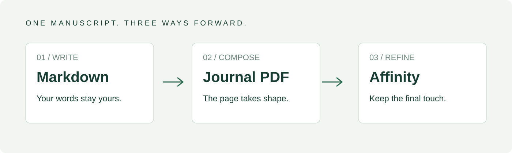
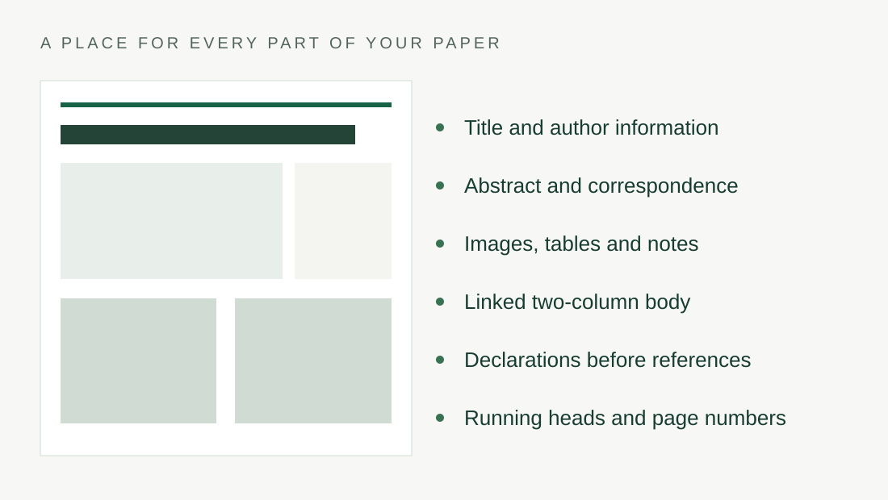

## A better last mile for your research

The research is the reason for the paper. The layout should help readers find it. A clear heading, an unbroken caption and a table with room to breathe are small decisions that add up to a document worth spending time with. Making those decisions repeatedly, across columns and pages, can consume the attention you wanted to give to the argument.

Academic Editor Ultra brings structured writing and careful composition into the same workflow. This is not a second place to maintain the article. In Markdown mode, the note remains the source of the words. The composition project holds the layout, the selected template and the review history. You can return to the note, improve a paragraph and generate another proof without copying the article back out of a design file.

### Try it before reading the whole guide

Open **Basic information** in the manuscript panel. Replace the title with a sentence of your own, then choose **Refresh preview**. The first-page title changes while its font, position and surrounding space are still handled by the selected template. Next, open **Abstract and keywords**, change a sentence and refresh again. The linked Markdown note receives both changes.

This small experiment captures the central idea. You supply the information once, in a place you already know how to edit. The document gives that information a consistent visual home. Figure 1 shows how this connected workflow continues beyond the proof. The same approach works for author names, affiliations, correspondence, running heads and statements that need to appear before the references.

Figure 1. One manuscript, from familiar writing to a composed PDF and an editable Affinity document.

## Write with familiar tools

Use ordinary Markdown for the body: headings, paragraphs, emphasis, lists, image links and tables. The article title belongs in its dedicated property; the first body section starts with a level-two heading. Subsections use the next heading level. You do not need to draw a text frame or decide where every paragraph will end before you begin writing.

Images can live beside the manuscript in your vault. Standard HTTPS image links are also supported. This offline sample uses local files so the first exercise does not depend on a remote server. The production workflow stores the actual image bytes used for a composition. If a remote image is replaced at the same address, the refresh action lets you deliberately retrieve a new version.

Keep captions next to the objects they describe. Give a table its title immediately before the Markdown table and place its note immediately after it. The importer can preserve that relationship and the composer can treat the title, body and note as a related set. Clear input is the simplest way to get a clear page. Table 1 gives a few practical examples.

Table 1. Small choices in the manuscript, visible benefits on the page

| Write this once | See it here |
| --- | --- |
| Title property | First-page title |
| Abstract property | Abstract panel |
| Figure caption | Beside its image |
| Table note | With its table |
| Closing statement | Before References |

Note. These are mapping examples, not measurements. The same text is not maintained in two separate editors.

### Keep the article and the appearance distinct

A template supplies a consistent visual identity. Try **Journal of Achmage** in deep navy, then **Journal of Command & Space** in teal and pink. Both include original vector PDF logo artwork. Choose a preset from the top **Template** list; it applies immediately. Your words remain unchanged. Select logos, a key color, the abstract background and recurring publication text without rebuilding the page geometry. Article properties supply the information that changes from one manuscript to the next. Empty overrides can inherit the template; explicit hide properties let you omit a field intentionally.

You can inspect all dedicated properties from the journal workspace. The full template is available when you need it, but this guide only fills the properties it uses. Author lists, sidebar entries and additional closing statements can grow with the article. A short guide and a detailed journal submission can use the same underlying composition path.

## Let the page take shape

The composer works with the structure of the manuscript. Body text continues through the left column, the right column and the following page. Tables and figures have their own placement needs. Some belong within a column; others need the full body width. Captions and notes remain part of that decision rather than becoming loose paragraphs you have to rescue later.

A useful proof invites inspection. Look at a heading above a subsection, the space around a table and the way the first page brings the abstract and correspondence together. These details matter because they support reading. This guide uses the normal composition engine, so the pages you see are the same kind of pages produced from your own source. Figure 2 maps the main article fields.

Figure 2. Article information has a consistent place. This schematic explains the mapping; it is not a screenshot of a composed page.

### Review what the software cannot know

A date supplied by an editorial system is a fact to verify, not a gap for the layout engine to invent. The same is true of a DOI, an author's contact details and a declaration about data access. Dedicated properties and review panels make these facts easier to enter and inspect while leaving the editor in control of their accuracy.

APA-oriented checks and reference tools help surface issues. Crossref lookup can provide candidates for comparison, but a plausible record is not automatic proof of identity. Review the source, accept the right correction and regenerate the document. The goal is to make editorial judgment easier to apply, not to conceal it behind a polished page. Table 2 separates the source from the final review.

Table 2. What stays in the source, and what belongs to the final review

| Part of the work | Primary place | What to verify |
| --- | --- | --- |
| Wording and metadata | Markdown note | Meaning, names and publication facts |
| Identity and appearance | Journal template | Logo, color and recurring text |
| Tables and captions | Source plus proof | Values, labels and readable grouping |
| Reference corrections | Source and review tools | Correct work, author order and DOI |
| Last design adjustment | Affinity editing copy | Line endings, page flow and overset text |

Note. The Affinity file is a downstream editing copy. Changes made there do not write themselves back into the Markdown source.

## Keep the final touch yours

Sometimes the fastest final adjustment is a manual one. Export the Affinity file when that moment arrives. Body frames are connected across columns and pages, while supported figures and other objects remain separately selectable. You can inspect the frames, refine a detail and save the design document in Affinity.

Open the exported sample and select a body text frame. Follow its connection to the next column and then the next page. Select a figure to see that it is a separate object. Inspect the master spread and page-number field. These are the practical details that make an editing handoff useful, beyond the appearance of the first screenshot.

The PDF remains the composition proof. Affinity uses its own text engine, so review line endings and the final frame after making changes. If text is overset, it remains in the story; it needs more visible frame space. Extending the connected frames is different from shortening or silently discarding the manuscript.

### A complete, repeatable first exercise

Change the title and one abstract sentence. Compose a new proof. Inspect both tables and their notes. Export the PDF, then export the Affinity editing package. Open its document, select a linked body frame and make one small adjustment. Save and reopen the result. You have now taken a source manuscript through the same route the larger workflow uses.

Keep this edited sample as a reference. The **Open sample manuscript** action returns to it; **Create a fresh copy** gives you a separate starting point. Your changes remain yours. When you are ready, begin a new Markdown manuscript or import a Word manuscript from an author. Word input follows the existing review-and-edit path; Markdown input continues to use the note as its source of truth.

## References

Obsidian. (n.d.). *Obsidian Help*. https://help.obsidian.md/

Typst. (n.d.). *Typst documentation*. https://typst.app/docs/
